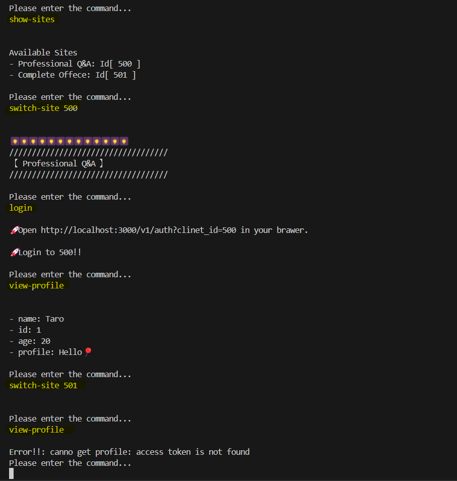
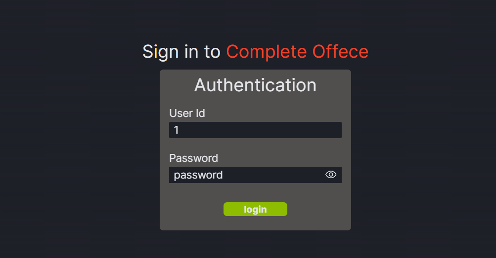
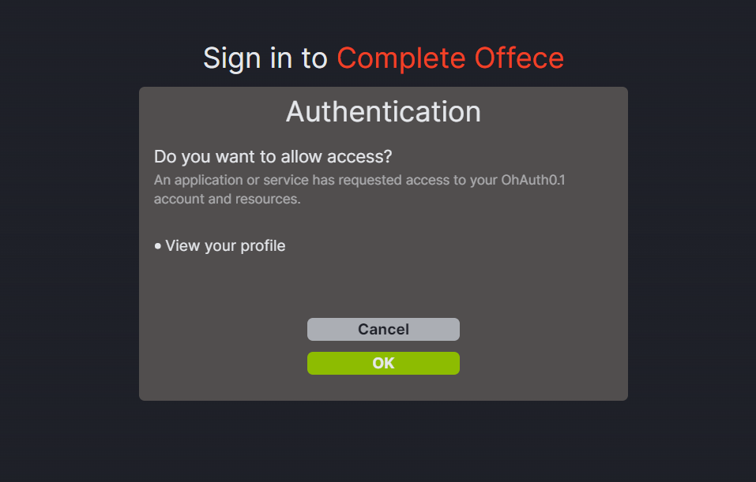
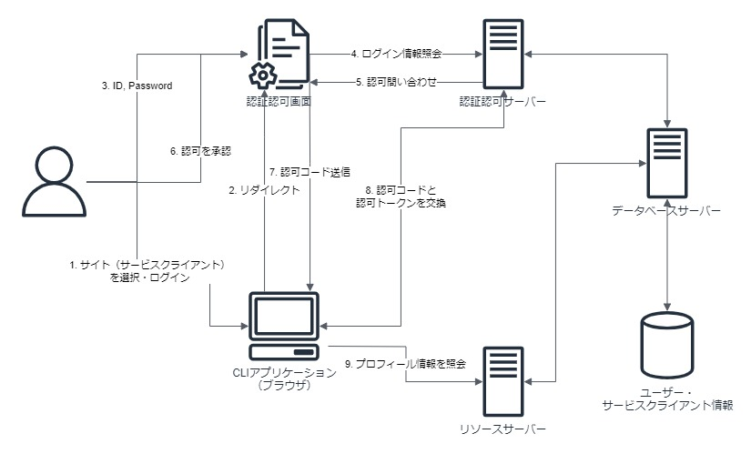

# OhAuth0.1

OAuth2.0プロバイダーを作る！
OAuth2.0をより理解するために、認可サービスを作成します。

たぶん実際よりももっと簡単なものになるので、このサービスを`OhAuth0.1`と呼ぶことにする。

## 使い方

1. 各サーバを起動 `make start`
2. クライアントアプリケーションを起動 `make cli`

`make cli` で `help` + `Enter`

### CLIの使用例

1. サイト（Q&Aサイト）に移動 `switch-site 500`
2. ログイン `login`
3. ブラウザを立ち上げる `http://localhost:3000/v1/auth?clinet_id=500`
4. ID: 1, PASSWORD: password を入力する。
5. 認可をOKする。
6. プロフィールを参照する `view-profile`
7. 別のサイト（オフィスアプリサービス）に移動 `switch-site 501`
8. プロフィールが確認できないことを確認する `view-profile`

### 使用例イメージ

サービスクライアントを使用例イメージ。

- 認可した`500`でのみプロフィールを閲覧



- 認証画面



- 認可画面



## 構成

基本的にGo、WebはNext.jsを利用。

### 構成図



### データベースモデル

```proto
message UserProfile {
 string id = 1;
    string password = 2;
    string name = 3;
    uint32 age = 4;
    string profile = 5;
}
message ServiceClient {
    string id = 1;
    string secret = 2;
    string name = 3;
    string redirect_uri = 4;
    string scope = 5;
}
message AuthorizationCode {
    string code = 1;
    string user_id = 2;
    string service_client_id = 3;
    google.protobuf.Timestamp expires = 4;
    string scope = 5;
}
message AccessToken {
    string token = 1;
    string user_id = 2;
    string service_client_id = 3;
    google.protobuf.Timestamp expires = 4;
    string scope = 5;
}
message RefreshToken {
    string token = 1;
    string user_id = 2;
    string service_client_id = 3;
    google.protobuf.Timestamp expires = 4;
    string scope = 5;
}
```

#### 保存済みデータ

```golang

map[string]*apiv1.UserProfile{
    "1": {
        Id:       "1",
        Password: "password",
        Name:     "Taro",
        Age:      20,
        Profile:  "Hello🎈",
    },
    "2": {
        Id:       "2",
        Password: "password",
        Name:     "Hanako",
        Age:      20,
        Profile:  "Hello🌸",
    },
}

map[string]*apiv1.ServiceClient{
    "500": {
        Id:          "500",
        Name:        "Professional Q&A",
        Secret:      "secret",
        RedirectUri: "http://localhost:7777",
        Scope:       "profile:view",
    },
    "501": {
        Id:          "501",,
        Name:        "Complete Offece",
        Secret:      "secret",
        RedirectUri: "http://localhost:7777",
        Scope:       "profile:view",
    },
 }

```

### ディレクトリ構成

#### ./internal/auth

認証・認可用サーバー。ログイン情報を受け取り、認可コードやトークンを発行する。

#### ./internal/database

認証・認可情報を保存するデータベースサーバー。またユーザのプロフィール情報を保存している。
今回は、認証認可サーバーからのアクセスと、リソースサーバからのトークンの検証を受け付ける。

オンメモリで永続化は非対応。
ログイン情報・サービスクライアント情報はハードコード。

#### ./internal/resource

リソースサーバー。トークンを受け取り検証してユーザのリソースを返す。
検証は、データベースサーバーを直接参照する。

今回は、プロフィール情報の閲覧のみに対応している。

#### ./internal/service-client

認可サービスを利用するサービスクライアント。
一連の認証・認可の流れをCLIで動作させる。

#### ./web

認証・認可のUI。IDとパスワード、認可の確認画面を持つ。

#### ./api

データベースサーバーの通信用。コード自動生成。

#### ./logs

`make start` のときの各サーバーのログ。
